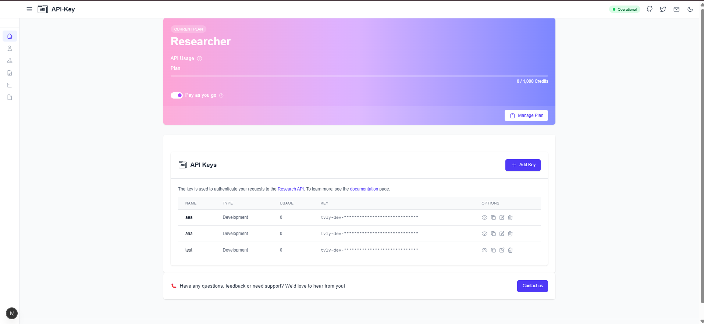

# API Management Application

## Screenshots
Here are some screenshots of the application in action:



## Overview
This is a Next.js TypeScript application for managing API keys with Supabase authentication and database integration.

## Features
- Create, read, update, and delete API keys
- User authentication
- Secure API key management
- Responsive design

## Prerequisites
- Node.js (v18 or later)
- npm or Yarn
- Supabase account

## Setup

### 1. Clone the Repository
```bash
git clone https://github.com/yourusername/api-management.git
cd api-management
```

### 2. Install Dependencies
```bash
npm install
```

### 3. Environment Configuration
Create a `.env.local` file with the following variables:
```
NEXT_PUBLIC_SUPABASE_URL=your_supabase_project_url
NEXT_PUBLIC_SUPABASE_ANON_KEY=your_supabase_anon_key
```

### 4. Run the Development Server
```bash
npm run dev
```

Open [http://localhost:3000](http://localhost:3000) with your browser to see the result.

## Technologies
- Next.js 15
- TypeScript
- Tailwind CSS
- Supabase
- React Hot Toast

## Contributing
1. Fork the repository
2. Create your feature branch (`git checkout -b feature/AmazingFeature`)
3. Commit your changes (`git commit -m 'Add some AmazingFeature'`)
4. Push to the branch (`git push origin feature/AmazingFeature`)
5. Open a Pull Request

## License
Distributed under the MIT License. See `LICENSE` for more information.

## Screenshot


The screenshot above shows the API Key management interface, which allows users to:
- View existing API keys
- Add new API keys
- Manage current plan and usage
- Perform key-related actions
